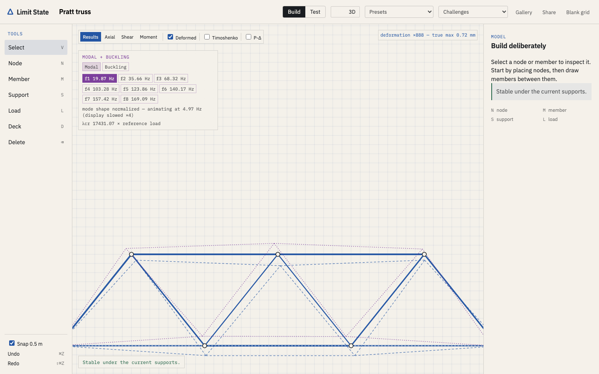
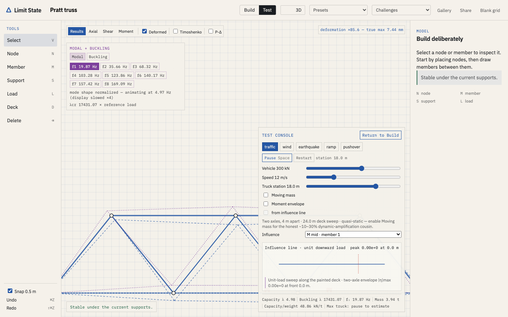
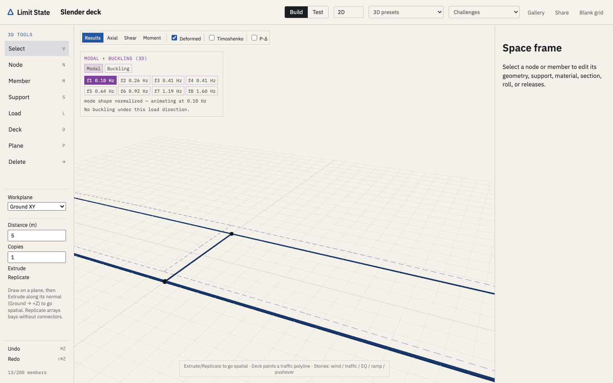
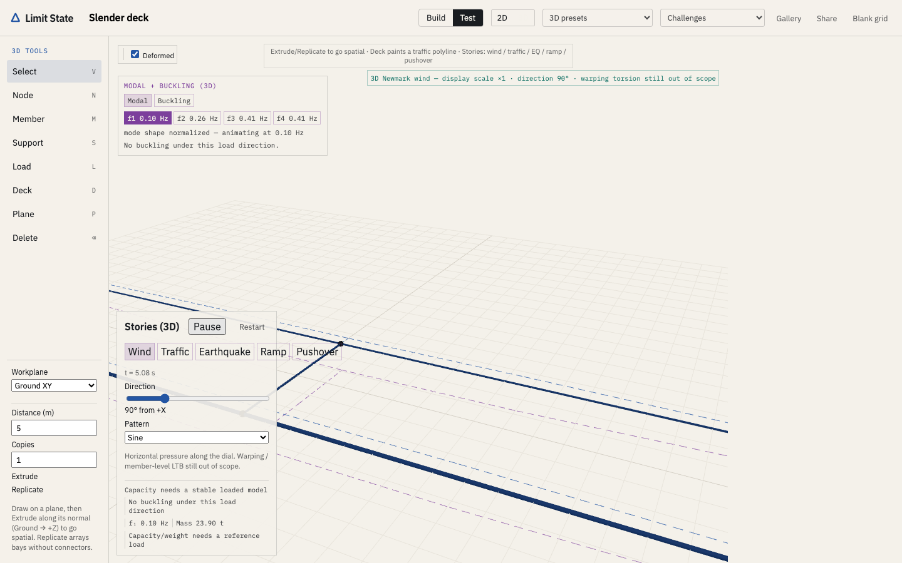

# Limit State

**A structural sandbox that tells the truth.**

_Limit state design_ is the foundational framework of modern structural engineering: identify the states at which a structure ceases to satisfy its criteria, and design against them. This is the interactive version.

Sketch a bridge or a tower. Watch stress flow through every member, live. Drive a truck across it. Dial wind up to a natural frequency and feel it fight back. And when it fails, Limit State doesn't play an explosion sound — it names the mechanism: _yield_, _buckling (with the eigenmode)_, _resonance (with the mode it excited)_, or _mechanism_ — with the numbers that prove it.

Construction games fake physics with springs. Real finite-element analysis lives in five-figure desktop suites. Limit State is the unclaimed middle: a **true FEM core** — direct stiffness method, eigenvalue buckling, modal analysis, Newmark time integration — under a surface you can play with in a browser tab.

## What you can do

- **Build (2D + 3D)** — nodes, members, pins, rollers, hinges; steel, aluminum, timber, or spaghetti; real sections (box, I-beam, tube). In 3D: workplanes (ground / elevation / custom), extrude & replicate, deck polylines, and spatial presets from Pratt to twin-girder slender deck.
- **Test** — load stories in both dimensions: **traffic** across a deck (2D moment envelope + influence lines; 3D quasi-static or moving-mass Newmark), **wind** (steady / sine / gusts — 3D gains a direction dial), **earthquake** base excitation, **ramp** to first limit, and **pushover** with plastic hinges.
- **Break** — and get a straight answer. A collapse timeline shows load redistributing after the first member goes: _member 7 buckled → member 8 overstressed → hinge → mechanism._ Capacity-to-weight stays on the panel.
- **Share** — the whole model lives in the URL (schema v1 → 2D, v2 → 3D). No accounts, no server, no data leaves your machine.









## Honesty, stated plainly

Every number is computed by the real method; every flourish is labeled. Deformed shapes carry their exaggeration factor ("×120 — true max 3.2 mm"). The collapse animation is labeled quasi-static. The 2D slender-deck preset shows bending resonance only; its 3D twin-girder cousin exposes a real St. Venant torsional mode.

Two things this sandbox will not fake, and says so in the product:

- **Aeroelastic flutter.** Tacoma Narrows failed by flutter with warping. That is not what the wind story models, and the app never implies otherwise.
- **Warping torsion and member-level lateral-torsional buckling.** Out of scope for the element formulation.

The solver is verified against closed-form solutions on every test run — cantilever deflection to 1e−10, Euler buckling to 0.8%, beam frequencies to 0.5%. Those benchmarks are what `npm test` checks, and they run in CI.

## Run it

Requires Node 22+; CI and `.nvmrc` pin Node 22.22.0.

```bash
npm ci
npm run dev        # local dev server on http://localhost:3000
```

The 3D view needs WebGL; eigen solves run in a Web Worker.

## Verify

```bash
npm run check:version
npm audit --omit=dev --audit-level=high
npm run typecheck
npm run lint
npm run check:citations
npm run format:check
npm run build      # static export in out/
npm run check:csp
npm run budget:bundle
npm test           # solver checks against the closed-form benchmarks
npx playwright install chromium
npm run test:e2e   # Chromium tests against the static export
```

To refresh README stills after a UI change, run `npm run build && npm start` (port 3012 by default),
then run `npm run screenshots` in another terminal.

## Deploy

Static, client-side, no backend. The repository includes pipelines for both major Pages hosts:

- **GitHub Pages** — `.github/workflows/ci.yml` verifies pull requests and deploys green pushes to
  `main`. Set Pages → Source to GitHub Actions in the repository settings.
- **GitLab Pages** — `.gitlab-ci.yml` runs the same gates and publishes `out/` from green pushes to
  `main`.

Both set `BASE_PATH` for project-site subpaths; for a custom domain or root site, set it to `''` in the pipeline. Or `npm run build` and drop `out/` on any static host.

Whatever host serves the export should send the response headers documented in
[docs/STATIC-HOST-HEADERS.md](docs/STATIC-HOST-HEADERS.md) — in particular `worker-src 'self'`,
without which modal and buckling analysis stops working while the rest of the app still renders.
`vercel.json` and `serve.json` carry the same policy in the two formats hosts read, and
`npm run check:csp` fails if they and the document ever disagree. Note that neither GitHub Pages nor
GitLab Pages can set custom response headers, so on those two hosts the policy is documentation
rather than enforcement — worth weighing when choosing the deployment target.

## Stack

Next.js (static export) · React 19 · TypeScript (strict) · Zustand · Canvas2D + three.js (3D). The FEM kernel (`src/fem/`) is hand-rolled on `Float64Array` with **zero numerics dependencies** — Euler–Bernoulli frame elements (2D + 12-DOF space frame), LDLᵀ / skyline+RCM free solves, subspace-iteration eigenanalysis, Newmark-β dynamics. Eigen solves run in a Web Worker, and traffic reuses cached factorizations for single back-substitutions.

## License

MIT — see [LICENSE](./LICENSE).

---

**Version:** v0.11.6
